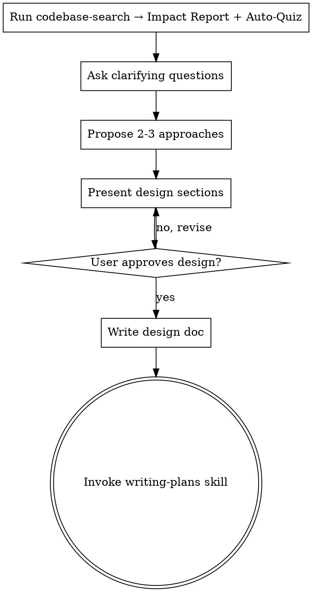

<!-- StakTrakr project override — adds Phase 0 worktree gate before the standard flow.
     Superpowers body synced from: superpowers@claude-plugins-official (2026-02-24).
     When the plugin updates brainstorming significantly, copy the updated body below. -->

## Phase 0 — Worktree Gate

**Run this before any other step.**

StakTrakr uses isolated git worktrees to prevent agents from competing on the same files.
This gate ensures brainstorming only proceeds when work will land in a safe location.

### Check 1: Are we already in a worktree?

```bash
git rev-parse --git-common-dir   # path to main repo's .git
git rev-parse --git-dir          # .git in main checkout; .git/worktrees/NAME in a worktree
```

If the two values differ → you are inside a worktree. ✅ Skip to the brainstorming flow below.

### Check 2: Is a version lock claimed for this work?

```bash
cat devops/version.lock 2>/dev/null || echo "UNLOCKED"
```

With the claims-array format, read the `claims` array and filter out expired entries
(`expires_at` < now). If at least one active claim exists for the work you are about to
start → ✅ proceed.

### If neither check passes — STOP

```
⛔ No worktree is active and no version lock is claimed.

Starting brainstorming directly on `dev` risks writing code outside a
patch/VERSION worktree, which breaks the multi-agent isolation protocol.

Before proceeding, choose one:
  A) Run `/start-patch`   — pick a Linear issue, claim a version, create a worktree
  B) Run `/release patch` — claim version and create worktree directly
  C) Continue on `dev`    — only safe if this is design-only work (no code today)

Which would you like to do?
```

Wait for the user's choice. If they choose **C**, note it clearly and continue to the
brainstorming flow below. If **A** or **B**, wait for the worktree to be created, then
resume brainstorming from Step 1.

---

# Brainstorming Ideas Into Designs (SRPI Specification Phase)

## Overview

Turn ideas into fully formed designs and specs through collaborative dialogue — grounded in the actual codebase before a single question is asked.

This skill is the **Specification** phase of the SRPI loop (Specify → Research → Plan → Implement). It ends when a design doc is committed and the writing-plans skill is invoked.

## SRPI vs RPI Decision

Choose the right entry point before starting:

| Situation | Entry Point | Why |
|---|---|---|
| New feature or capability | **SRPI** — start here (brainstorming) | Unknown scope, needs design |
| UI change with ≥3 data elements | **SRPI** — start here | Layout uncertainty |
| Enhancement to existing behavior | **SRPI** — start here | May ripple through more files than expected |
| Bug fix with clear root cause | **RPI** — skip to codebase-search → writing-plans | Scope is defined |
| Tech debt / refactor with known boundary | **RPI** — skip to codebase-search → writing-plans | No design ambiguity |
| Small refinement (single function, single file) | **RPI** — skip to codebase-search → writing-plans | YAGNI on the design doc |

If in doubt, use SRPI. The design phase can be short.

## Checklist

Complete these steps in order:

1. **Run codebase-search** — produce Codebase Impact Report and complete Auto-Quiz before anything else
2. **Ask clarifying questions** — one at a time, grounded in Impact Report findings
3. **Propose 2-3 approaches** — each referencing existing patterns from the Impact Report
4. **Present design** — in sections scaled to complexity, get user approval after each section
5. **Write design doc** — save to `docs/plans/YYYY-MM-DD-<topic>-design.md` and commit
6. **Transition to planning** — invoke writing-plans skill

## Process Flow



The terminal state is invoking writing-plans. The only skill invoked after brainstorming is writing-plans.

## The Process

### Step 1 — Codebase Search (mandatory first action)

Invoke the codebase-search skill immediately. Do not ask clarifying questions first.

Produce a **Codebase Impact Report** containing:
- Files most likely to be touched
- Existing patterns relevant to this feature (naming conventions, data flow, module boundaries)
- Potential ripple effects (what else calls or depends on those files)
- Any prior art in the codebase (similar features already built)

Then complete the **Auto-Quiz** before proceeding:
- What does the user actually want to achieve? (not just what they said)
- Are there existing patterns in the codebase this should follow?
- What is the smallest surface area that delivers the value?
- What could go wrong at the seams between new and existing code?

<HARD-GATE>
Do not ask clarifying questions or propose approaches until codebase-search is complete and the Auto-Quiz is answered.
</HARD-GATE>

### Step 2 — Clarifying Questions

Ask questions one at a time, grounded in Impact Report findings. Prefer multiple choice. Focus on: purpose, constraints, success criteria, edge cases the Impact Report surfaced.

### Step 3 — Proposed Approaches

Propose 2-3 approaches. Each approach must:
- Reference existing patterns found in the Impact Report
- State which files it touches (cross-check against Impact Report)
- Describe trade-offs clearly
- Lead with your recommendation and reasoning

### Step 4 — Design Presentation

Once you understand what is being built, present the design in sections scaled to complexity. Ask after each section whether it looks right. Cover: architecture, components, data flow, error handling, testing approach.

## After the Design

**Documentation:**
- Write the validated design to `docs/plans/YYYY-MM-DD-<topic>-design.md`
- Include the Impact Report file list in the design doc header
- Commit the design document to git

**Implementation:**
- Invoke the writing-plans skill to create the implementation plan
- Do not invoke any other skill. writing-plans is the next step.

## Key Principles

- **Codebase-search first, always** — never design in a vacuum
- **One question at a time** — do not overwhelm with multiple questions
- **Approaches reference existing patterns** — no orphan designs
- **YAGNI ruthlessly** — remove unnecessary features from all designs
- **Incremental validation** — present design sections, get approval before moving on
