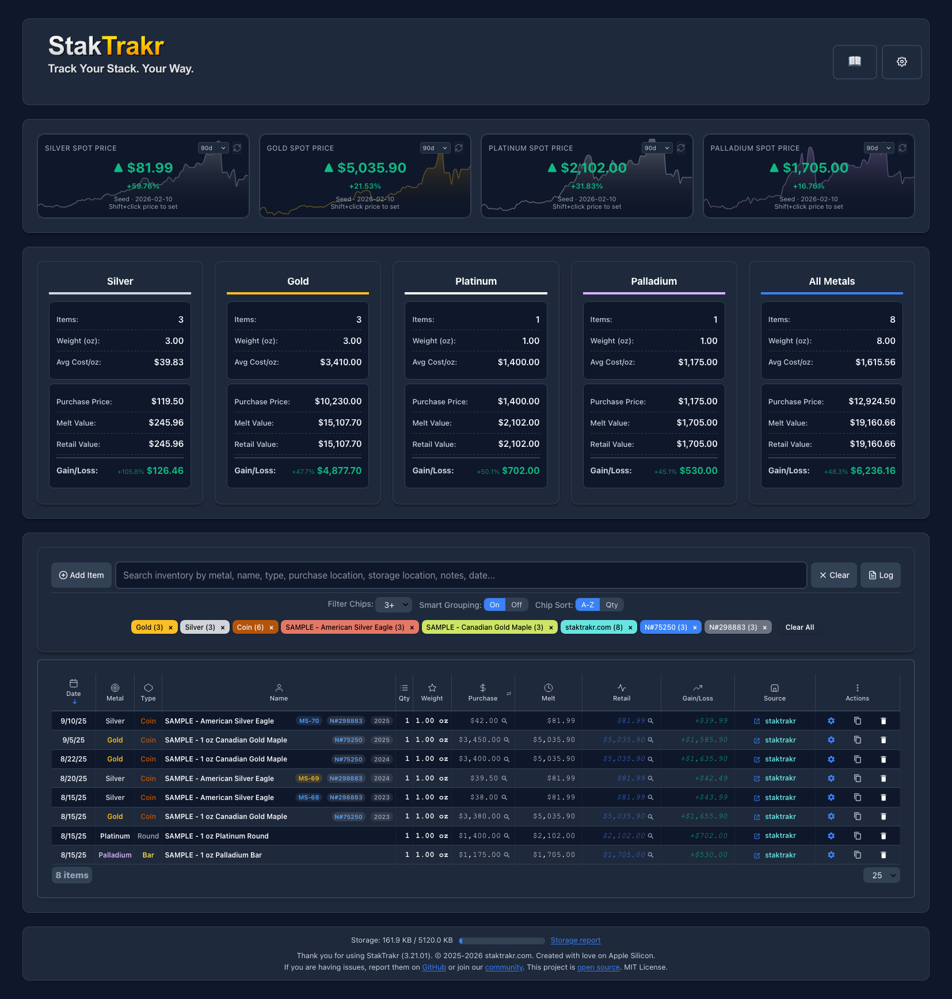

# StakTrakr
 
[](https://github.com/lbruton/StakTrakr/blob/main/LICENSE)
[](https://app.codacy.com/gh/lbruton/StakTrakr/dashboard?utm_source=gh&utm_medium=referral&utm_content=&utm_campaign=Badge_grade)
[](https://github.com/lbruton/StakTrakr/issues)
[](https://www.reddit.com/r/staktrakr/)
[](https://github.com/sponsors/lbruton)
[](https://claude.ai/code)

**Track your precious metals stack. Your Way!**

A powerful, privacy-first precious metals portfolio tracker for Silver, Gold, Platinum, Palladium, and Goldbacks. Runs entirely in your browser — Your stack, your data, your rules.


**Give it a try today at:** [www.staktrakr.com](https://www.staktrakr.com)




---

## Why StakTrakr?

Most portfolio trackers want your email, store your data on their servers, or lock features behind a paywall. StakTrakr is different:

- **100% client-side** — while you can use the hosted application at [staktrakr.com](https://www.staktrakr.com), all data is stored entirely in your browser. The full source code is available to anyone who wishes to run it offline — even from a single HTML file on `file://` protocol
- **Zero data collection** — everything lives in your browser's localStorage
- **No account required** — open the page and start tracking
- **Works offline** — no internet needed after first load
- **Open source** — MIT licensed, fork it, hack it, make it yours

---

## Features

### Live Spot Prices & Sparklines

Real-time spot prices from multiple API providers with automatic failover. Each metal card shows:

- **Live price** with up/down/unchanged indicators
- **Sparkline charts** — interactive mini price charts (7d / 30d / 60d / 90d range selector)
- **Percentage change** — see how each metal has moved over your selected timeframe
- **Provider rotation** — configure multiple API keys and drag-to-reorder sync priority
- **Seed data included** — 6 months of historical prices baked in, so sparklines work from day one with no API key needed

### Portfolio Tracking

Full per-item tracking with a rich data model:

- **Purchase Price / Melt Value / Retail Price** with computed Gain/Loss
- **Percentage gain/loss** shown per-metal and portfolio-wide
- **Goldback support** — denomination-aware pricing (1, 5, 10, 25, 50) with manual rate management, separate from spot metal APIs
- **Year, Grade, Grading Authority, Cert #** — full numismatic metadata
- **PCGS catalog numbers** with inline chips and one-click CoinFacts lookup
- **PCGS cert verification** — verify grading directly from the inventory table
- **Serial numbers** for bars and notes with physical markings
- **Notes** per item with indicator badges

### Smart Filter Chips

A powerful filtering system that adapts to your collection:

- **Auto-generated chips** — Metal, Type, Name, Year, Grade, Numista ID, Source, and Storage Location chips appear automatically when items hit your threshold
- **Smart name grouping** — items like "American Silver Eagle" consolidate into a single chip with count badge
- **Custom grouping rules** — define your own chip labels (e.g., "Washington Quarters" matching multiple name variants)
- **Dynamic chips** — auto-extract text from parentheses and quotes in item names
- **Chip blacklist** — right-click to hide chips you don't want
- **10 configurable categories** — enable/disable, reorder, and sort (A-Z or by quantity)

### Numista & PCGS Integration

- **Numista search** — look up any coin by name, get catalog numbers, years, and metadata
- **PCGS lookup** — search by PCGS number, populate form fields from catalog data
- **Inline chips** — N#, PCGS#, Grade, Year, Serial #, Storage Location, and Notes badges in the Name column (configurable in Settings > Table)
- **Cert verification** — click the grade badge on PCGS/NGC graded items to verify against the grading service

### Import / Export / Backup

- **CSV import** with intelligent field mapping, regex-based custom rules, and merge/override modes
- **CSV / JSON / PDF export** with all fields including numismatic metadata
- **ZIP backup** — full application state (inventory, settings, API keys, price history) in a single file
- **Encrypted vault backup** — AES-256-GCM encrypted `.stvault` files with password strength indicator. Portable across devices and browsers
- **Spot history import/export** — export price history as CSV, import on another device

### Bulk Edit

Full-screen bulk operations in Settings > Tools:

- Select multiple items with searchable checkbox table
- Edit 16 fields at once with enable/disable toggles
- Copy or delete items in bulk
- Numista Lookup fills bulk edit fields from catalog data

### Unified Settings

Everything in one place with sidebar navigation:

- **Site** — Theme picker (Light / Dark / Sepia), display preferences
- **Table** — Visible rows, inline chip configuration and ordering
- **Chips** — Category toggles, sort order, grouping rules, blacklist
- **API** — Tabbed provider configuration with drag-to-reorder priority, Numista and PCGS tabs, usage tracking
- **Files** — Import/Export, encrypted vault, spot history
- **Log** — Full change log with undo capability
- **Tools** — Bulk Edit

### More

- **Scrollable portal view** with sticky column headers (replaces traditional pagination)
- **Shift+click inline editing** — click any editable cell to edit in place
- **Multi-column sorting** — click headers to sort, qty-adjusted for computed columns
- **Fuzzy search** across all fields including Year, Grade, Cert #, and Numista ID
- **Four themes** — Light, Dark, Sepia, and System-detected
- **Change log** — tracks every edit with full undo/redo
- **Storage dashboard** — see exactly how much localStorage you're using

---

## Getting Started

### Option 1 — Just open it

```
open index.html
```

Works directly from the filesystem. No server required.

### Option 2 — Local HTTP server

```
python -m http.server 8000
```

### Option 3 — Live site

Visit [www.staktrakr.com](https://www.staktrakr.com) — same app, hosted on Cloudflare Pages.

### First launch

StakTrakr comes pre-loaded with **sample inventory items** and **6 months of spot price history** so you can explore every feature immediately. The sample items are clearly labeled "SAMPLE" — edit or delete them whenever you're ready to add your own stack.

To get live spot prices, grab a free API key from [Metals.dev](https://metals.dev) and paste it into Settings > API.

---

## Tech Stack

| Layer | Technology |
|-------|-----------|
| Runtime | Pure client-side JavaScript (no framework) |
| Storage | Browser localStorage |
| Encryption | Web Crypto API (AES-256-GCM via PBKDF2) |
| Styling | Vanilla CSS with responsive breakpoints |
| Charts | Chart.js 3.9.1 |
| CSV | PapaParse 5.4.1 |
| PDF | jsPDF 2.5.1 + AutoTable 3.5.25 |
| Backup | JSZip 3.10.1 |
| Hosting | Cloudflare Pages |

---

## Project Structure

```
index.html              Main application (single page)
css/styles.css          Complete styling
js/                     35+ JavaScript modules
  constants.js            Global config, API providers, storage keys
  state.js                Application state management
  inventory.js            Core CRUD, table rendering, CSV/PDF/ZIP export
  events.js               Event handlers and UI interactions
  spot.js                 Spot price history, sparklines, card indicators
  seed-data.js            First-time user seed data (spot history + samples)
  api.js                  Multi-provider pricing API integration
  filters.js              Smart filter chips with 10 categories
  chip-grouping.js        Custom grouping rules engine
  sorting.js              Multi-column table sorting
  charts.js               Chart.js spot price visualization
  vault.js                AES-256-GCM encrypted backup
  bulkEdit.js             Bulk item operations
  pcgs-api.js             PCGS cert verification
  catalog-api.js          Numista API client
  settings.js             Unified settings modal
  init.js                 Application initialization (loads last)
  ...and more
data/                   Seed spot price history (JSON)
docs/                   Architecture documentation
```

---

## License

MIT License. See [LICENSE](LICENSE) for details.

Contributions via fork and pull request are welcome. Report issues at [GitHub Issues](https://github.com/lbruton/StakTrakr/issues).
