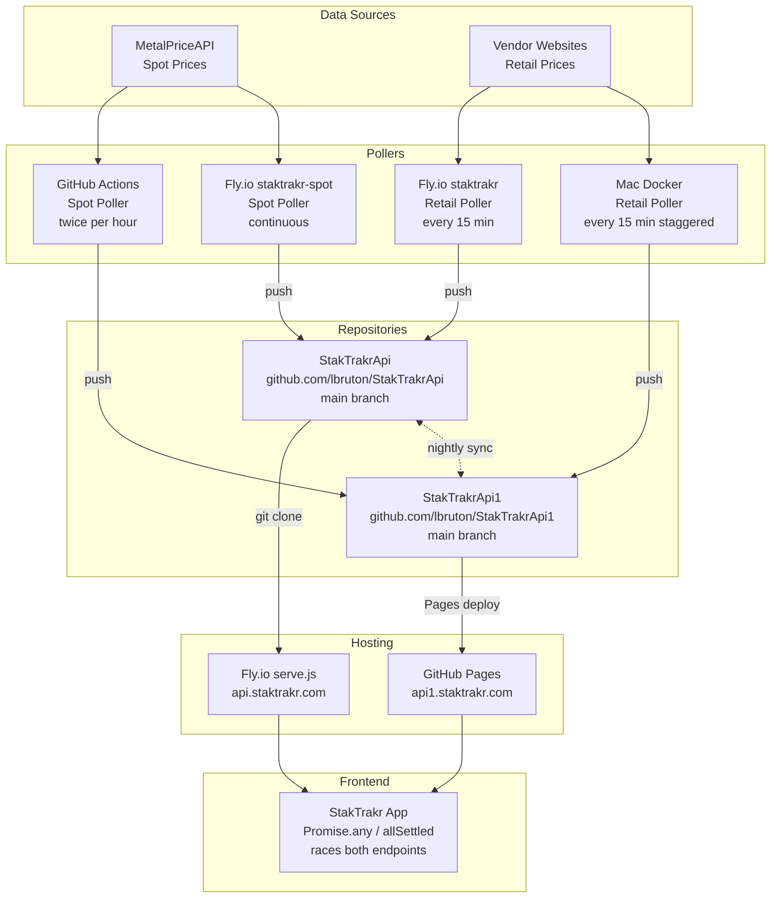

# StakTrakr API Infrastructure Guide

Complete reference for the dual-repo, dual-poller API system that serves spot and retail precious metals prices to the StakTrakr frontend.

---

## Table of Contents

1. [Architecture Overview](#architecture-overview)
2. [Repository Map](#repository-map)
3. [Endpoint URLs and Data Paths](#endpoint-urls-and-data-paths)
4. [Data Directory Structure](#data-directory-structure)
5. [Pollers](#pollers)
   - [Spot Price Poller (GitHub Actions)](#spot-price-poller-github-actions)
   - [Spot Price Poller (Fly.io)](#spot-price-poller-flyio)
   - [Retail Poller (Fly.io)](#retail-poller-flyio)
   - [Retail Poller (Mac Docker)](#retail-poller-mac-docker)
6. [Frontend Endpoint Racing](#frontend-endpoint-racing)
7. [Nightly Sync Workflow](#nightly-sync-workflow)
8. [Secrets and Authentication](#secrets-and-authentication)
9. [Deployment](#deployment)
10. [Troubleshooting](#troubleshooting)

---

## Architecture Overview

StakTrakr uses two identical API repositories served from two independent hosting platforms. Each platform has its own poller pushing data. A nightly GitHub Actions workflow syncs any gaps between them.



### Design Principles

- **1:1 mirroring:** Both repos have identical `data/` directory structures with the same paths
- **No single point of failure:** If one endpoint is down, the frontend automatically uses the other
- **No build step:** Repos contain only static JSON files served as-is
- **Append-only data:** Pollers only add files, never delete or overwrite existing data
- **Automatic gap filling:** 24-hour backfill on every spot poll + nightly cross-repo sync

---

## Repository Map

| Repository | URL | Hosting | Subdomain | Purpose |
|---|---|---|---|---|
| **StakTrakr** | `github.com/lbruton/StakTrakr` | Cloudflare Pages | `staktrakr.pages.dev` | Frontend app + all source code |
| **StakTrakrApi** | `github.com/lbruton/StakTrakrApi` | Fly.io (`staktrakr` app) | `api.staktrakr.com` | Primary API data (Fly.io pollers write here) |
| **StakTrakrApi1** | `github.com/lbruton/StakTrakrApi1` | GitHub Pages | `api1.staktrakr.com` | Fallback API data (GHA + Mac pollers write here) |

### Branch Strategy

All three repos use `main` as the default branch. The StakTrakr repo also has a `dev` branch where all active development happens. Workflows and cherry-picks flow from `dev` to `main`.

The API repos have **no code** — only data files. All poller code lives in the StakTrakr repo under `devops/`.

---

## Endpoint URLs and Data Paths

Both API endpoints serve identical directory structures under `/data/`:

### Spot Hourly Data (4 metals per hour)

```
https://api.staktrakr.com/data/hourly/YYYY/MM/DD/HH.json
https://api1.staktrakr.com/data/hourly/YYYY/MM/DD/HH.json
```

Example: `https://api.staktrakr.com/data/hourly/2026/02/22/14.json`

```json
[
  {"spot": 5107.31, "metal": "Gold", "source": "hourly", "provider": "MetalPriceAPI", "timestamp": "2026-02-22 14:00:00"},
  {"spot": 32.45, "metal": "Silver", "source": "hourly", "provider": "MetalPriceAPI", "timestamp": "2026-02-22 14:00:00"},
  {"spot": 978.20, "metal": "Platinum", "source": "hourly", "provider": "MetalPriceAPI", "timestamp": "2026-02-22 14:00:00"},
  {"spot": 965.50, "metal": "Palladium", "source": "hourly", "provider": "MetalPriceAPI", "timestamp": "2026-02-22 14:00:00"}
]
```

### Retail Price Data (per coin)

```
https://api.staktrakr.com/data/api/manifest.json
https://api.staktrakr.com/data/api/{coin-slug}/latest.json
https://api.staktrakr.com/data/api/{coin-slug}/history.json
```

Same paths on `api1.staktrakr.com`. The `manifest.json` contains a timestamp used for freshness ranking.

### Historical Seed Data (daily, by year)

```
https://api.staktrakr.com/data/spot-history-YYYY.json
```

Daily noon-reference prices for historical charts. Written once per day at 17:00 UTC (noon EST).

---

## Data Directory Structure

Both API repos share this layout inside `data/`:

```
data/
├── hourly/                          # Spot price hourly snapshots
│   └── YYYY/
│       └── MM/
│           └── DD/
│               ├── 00.json
│               ├── 01.json
│               ├── ...
│               └── 23.json
├── api/                             # Retail price data
│   ├── manifest.json                # { "updated": "ISO timestamp", "coins": [...] }
│   ├── american-gold-eagle/
│   │   ├── latest.json
│   │   └── history.json
│   ├── american-silver-eagle/
│   │   ├── latest.json
│   │   └── history.json
│   └── ...                          # 11 coins total
└── spot-history-YYYY.json           # Daily seed data (one file per year)
```

---

## Pollers

### Spot Price Poller (GitHub Actions)

**Workflow:** `.github/workflows/spot-poller.yml`
**Schedule:** Twice per hour (`:05` and `:35`)
**Writes to:** StakTrakrApi1 (`api1.staktrakr.com`)
**API:** MetalPriceAPI `/latest` and `/timeframe` endpoints

The workflow checks out `dev` from StakTrakr (for code) and `main` from StakTrakrApi1 (for data files):

```yaml
steps:
  - name: Checkout dev (for poller code)
    uses: actions/checkout@v4
    with:
      ref: dev
      path: code

  - name: Checkout StakTrakrApi1 (for data files)
    uses: actions/checkout@v4
    with:
      repository: lbruton/StakTrakrApi1
      ref: main
      path: data-branch
      token: ${{ secrets.API_PUSH_TOKEN }}
```

**Execution flow:**
1. `backfill_recent_hours()` — scans last 24 hours, fills any missing `HH.json` files via `/timeframe`
2. `poll_once()` — fetches `/latest`, writes current hour's `HH.json`
3. At 17:00 UTC (noon EST) — also writes daily seed entry to `spot-history-YYYY.json`
4. Commits and pushes to StakTrakrApi1 `main`

**Manual trigger:**
```bash
gh workflow run spot-poller.yml --ref main
```

### Spot Price Poller (Fly.io)

**App:** `staktrakr-spot`
**Script:** `devops/spot-poller/run-spot.sh` + `devops/spot-poller/poller.py`
**Schedule:** Continuous loop (every 3600s)
**Writes to:** StakTrakrApi (`api.staktrakr.com`)

Runs `poller.py` in daemon mode (no `--once`). On startup, runs `run_catchup()` to backfill from the last seed entry to yesterday, then enters the hourly polling loop. A wrapper script commits and pushes to StakTrakrApi `main` every hour.

**Key difference from GHA poller:** The daemon mode uses `run_catchup()` (fills daily seed gaps since last entry) instead of `backfill_recent_hours()` (fills hourly file gaps in last 24h). Both ultimately achieve gap-free data.

### Retail Poller (Fly.io)

**App:** `staktrakr`
**Config:** `devops/retail-poller/fly.toml`
**Schedule:** Every 15 minutes (`:00`, `:15`, `:30`, `:45`)
**Writes to:** StakTrakrApi (`api.staktrakr.com`)

All-in-one Fly.io container running:
- Firecrawl (web scraping engine) + PostgreSQL + Redis + RabbitMQ
- Retail poller (Node.js, scrapes 11 coins from 7 vendors)
- Gemini Vision pipeline (screenshot-based price verification)
- `serve.js` (static HTTP server on port 8080 — this IS the `api.staktrakr.com` endpoint)

```toml
[env]
  POLLER_ID = "main"
  API_DATA_REPO = "https://github.com/lbruton/StakTrakrApi.git"
  API_EXPORT_DIR = "/data/staktrakr-api-export"
```

The container clones StakTrakrApi on first boot, and `serve.js` serves files from the clone directory. The retail poller writes price data to the same directory, then commits and pushes periodically.

### Retail Poller (Mac Docker)

**Config:** `devops/firecrawl-docker/docker-compose.yml`
**Schedule:** Every 15 minutes, staggered (`:10`, `:25`, `:40`, `:55`)
**Writes to:** StakTrakrApi1 (`api1.staktrakr.com`)

Runs locally on the development Mac. Uses the same Firecrawl + retail-poller stack as Fly.io but targets the secondary repo.

```yaml
environment:
  POLLER_ID: main
  API_DATA_REPO: https://github.com/lbruton/StakTrakrApi1.git
  API_EXPORT_DIR: /tmp/staktrakr-api-export
  CRON_SCHEDULE: "10,25,40,55"
```

The staggered cron schedule means fresh retail data arrives every ~7 minutes across both pollers (Fly.io at `:00`/`:15`/`:30`/`:45`, Mac at `:10`/`:25`/`:40`/`:55`).

---

## Frontend Endpoint Racing

The frontend uses two different strategies depending on the data type.

### Spot Hourly: `Promise.any()` (first success wins)

**File:** `js/api.js` — `fetchHourlySpotPrices()`

```javascript
// Configured in js/constants.js
hourlyBaseUrls: [
  "https://api.staktrakr.com/data/hourly",
  "https://api1.staktrakr.com/data/hourly",
]
```

All endpoints are raced in parallel. The first successful response with valid data wins. If all fail, the function throws an `AggregateError`.

This is used for both the "current hour" fetch and the 24-hour lookback. Each hourly offset races both endpoints independently.

### Retail: `Promise.allSettled()` + freshness ranking

**File:** `js/retail.js` — `_pickFreshestEndpoint()`

```javascript
// Configured in js/constants.js
const RETAIL_API_ENDPOINTS = [
  "https://api.staktrakr.com/data/api",
  "https://api1.staktrakr.com/data/api",
];
```

1. Fetches `manifest.json` from all endpoints with an 8-second `AbortController` timeout
2. Ranks responses by `updated` timestamp (most recent wins)
3. Caches the winner in `_lastSuccessfulApiBase` for subsequent requests in the same session
4. If the winning endpoint fails on a subsequent request, falls back to re-ranking

---

## Nightly Sync Workflow

**Workflow:** `.github/workflows/sync-api-repos.yml`
**Schedule:** 5:00 AM UTC daily (midnight EST)
**Purpose:** Ensure both API repos have identical `data/` directories

The sync is **bidirectional and additive** — it copies missing files in both directions but never overwrites or deletes existing files:

```
StakTrakrApi ──missing files──→ StakTrakrApi1
StakTrakrApi1 ──missing files──→ StakTrakrApi
```

This catches any gaps caused by:
- One poller being down temporarily
- Timing differences between pollers
- GitHub Actions runner delays
- Network issues on either platform

**Manual trigger:**
```bash
gh workflow run sync-api-repos.yml
```

**Verification:**
```bash
gh run list --workflow=sync-api-repos.yml --limit=3
```

---

## Secrets and Authentication

### GitHub Actions Secrets (StakTrakr repo)

| Secret | Purpose | Where Used |
|---|---|---|
| `METAL_PRICE_API_KEY` | MetalPriceAPI authentication | `spot-poller.yml` |
| `API_PUSH_TOKEN` | GitHub PAT with `repo` scope for cross-repo pushes | `spot-poller.yml`, `sync-api-repos.yml` |

The `API_PUSH_TOKEN` is a GitHub personal access token (classic) that can push to both StakTrakrApi and StakTrakrApi1. The default `GITHUB_TOKEN` cannot push cross-repo.

### Fly.io Secrets

| Secret | App | Purpose |
|---|---|---|
| `GITHUB_TOKEN` | `staktrakr`, `staktrakr-spot` | Clone and push to StakTrakrApi |
| `METAL_PRICE_API_KEY` | `staktrakr-spot` | MetalPriceAPI authentication |
| `GEMINI_API_KEY` | `staktrakr` | Gemini Vision for retail price verification |
| `FIRECRAWL_API_KEY` | `staktrakr` | Firecrawl scraping engine auth |

Set via: `fly secrets set KEY=value -a staktrakr`

### Local Mac Docker

Secrets are stored in `devops/retail-poller/.env` (gitignored) and `devops/firecrawl-docker/.env` (gitignored). Source values live in the Infisical self-hosted secrets manager at `http://localhost:8700`.

---

## Deployment

### Fly.io Apps

**Retail poller + API server:**
```bash
cd devops/retail-poller
fly deploy -a staktrakr
```

**Spot poller:**
```bash
cd devops/spot-poller
fly deploy -a staktrakr-spot
```

After deploying, verify the data repo is current:
```bash
# SSH in and check the git checkout
fly ssh console -a staktrakr -C "git -C /data/staktrakr-api-export log --oneline -3"
```

If the container cloned an old version of the repo, force-update:
```bash
fly ssh console -a staktrakr -C "git -C /data/staktrakr-api-export fetch origin main && git -C /data/staktrakr-api-export reset --hard origin/main"
```

### Mac Docker Stack

```bash
cd devops/firecrawl-docker
docker compose up -d --build retail-poller
```

This rebuilds just the retail poller container. The Firecrawl, Redis, RabbitMQ, and PostgreSQL services are shared and usually don't need rebuilding.

### GitHub Actions Workflows

Workflows run from `main` branch (the default). After making changes to workflow files on `dev`:

1. Cherry-pick to main:
   ```bash
   git stash
   git checkout main
   git cherry-pick <commit-hash>
   git push origin main
   git checkout dev
   git stash pop
   ```

2. Or use a temporary worktree (if main checkout is blocked):
   ```bash
   git worktree add /tmp/staktrakr-cherry main
   cd /tmp/staktrakr-cherry
   git cherry-pick <commit-hash>
   git push origin main
   cd -
   git worktree remove /tmp/staktrakr-cherry
   ```

---

## Troubleshooting

### Hourly spot data returns 404

**Symptom:** `curl https://api.staktrakr.com/data/hourly/2026/02/22/14.json` returns 404.

**Check list:**
1. Has the spot poller run recently?
   ```bash
   gh run list --workflow=spot-poller.yml --limit=5
   ```
2. Does the file exist in the repo?
   ```bash
   gh api repos/lbruton/StakTrakrApi1/contents/data/hourly/2026/02/22/14.json --jq .name
   ```
3. Is Fly.io serving stale data? SSH in and check:
   ```bash
   fly ssh console -a staktrakr -C "ls /data/staktrakr-api-export/data/hourly/2026/02/22/"
   ```
4. Force git pull on Fly.io:
   ```bash
   fly ssh console -a staktrakr -C "git -C /data/staktrakr-api-export pull origin main"
   ```

### Retail data not updating

**Symptom:** `manifest.json` timestamp is stale.

1. Check Fly.io poller logs:
   ```bash
   fly logs -a staktrakr | tail -50
   ```
2. Check Mac Docker poller:
   ```bash
   docker logs firecrawl-docker-retail-poller-1 --tail 50
   ```
3. Verify Firecrawl is running:
   ```bash
   curl http://localhost:3002/v1/scrape -H "Content-Type: application/json" -d '{"url":"https://example.com"}'
   ```

### Sync workflow shows "0 files added" but pushed changes

**Known cosmetic bug.** The `while read | ...` pipeline in the sync workflow runs in a subshell, so counter variables don't propagate back. The log will say "Files added: 0" but git shows the correct number of files committed. This is harmless — the sync itself works correctly.

### GHA workflow fails with "file not found"

The `spot-poller.yml` workflow checks out code from `dev` branch and data from `StakTrakrApi1 main`. If `dev` doesn't have the expected files (e.g., `devops/spot-poller/requirements.txt`), the workflow fails. Ensure the workflow YAML on `main` matches the code on `dev`.

### Markets closed (no data on weekends)

Metal markets are closed Saturday and Sunday. The poller will log "no rates in response" or "no data returned" — this is normal. Backfill uses the `/timeframe` endpoint which returns the last known price for non-trading days.

### MetalPriceAPI rate limits

The paid tier allows 30-minute updates. The GHA poller runs at `:05` and `:35` to align with this. If you see HTTP 429 responses, check that you're not running extra manual triggers too frequently.

### GitHub Pages rebuild delay

After pushing to StakTrakrApi1, there's typically a 30–90 second delay before `api1.staktrakr.com` serves the new data. GitHub Pages rebuilds are not instant. If you need to verify a push immediately, check the repo contents directly:

```bash
gh api repos/lbruton/StakTrakrApi1/contents/data/hourly/2026/02/22/ --jq '.[].name'
```
