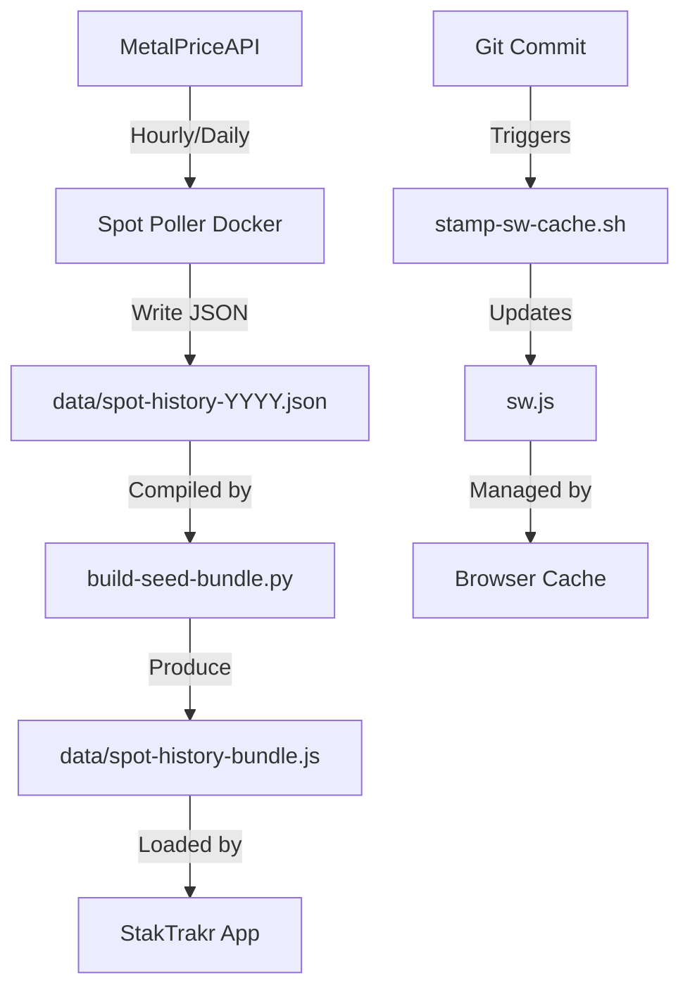

# StakTrakr DevOps Architecture

This document provides a high-level overview of the automation and tooling that supports the StakTrakr precious metals portfolio tracker.

## Overview

StakTrakr is a zero-dependency vanilla JS application. The DevOps layer focuses on three main areas:
1.  **Cache Management:** Ensuring the Service Worker cache is invalidated correctly on every change.
2.  **Historical Data:** Maintaining and bundling historical spot price data for offline use.
3.  **Automation:** Background polling of spot prices to keep seed data fresh.

## Core Components

### 1. Cache Stamping (Git Hooks)
To handle cache invalidation, a pre-commit hook (`devops/hooks/stamp-sw-cache.sh`) monitor staged files. If any core assets (`js/`, `css/`, `index.html`, etc.) are modified, it automatically updates the `CACHE_NAME` in `sw.js` with a new version-based timestamp. This ensures users always receive the latest assets.

### 2. Historical Data Pipeline
StakTrakr uses yearly JSON files (`data/spot-history-YYYY.json`) to provide historical price charts.
*   **Seed Bundler:** `devops/build-seed-bundle.py` compiles these JSON files into a single compact JS file (`data/spot-history-bundle.js`). This allows historical data to be loaded via a standard `<script>` tag, bypassing security restrictions on `file://` protocols.
*   **Spot Poller:** A Dockerized service (`devops/spot-poller/`) that runs continuously to fetch hourly and daily spot prices, keeping the repository's seed data up to date.

### 3. Documentation (JSDoc)
Documentation is generated automatically from JSDoc comments in the `js/` directory. The configuration resides in `devops/jsdoc/`, and a minimal `package.json` in `devops/` manages the JSDoc dependency without polluting the main project's zero-dependency footprint.

## Data Flow Diagram

